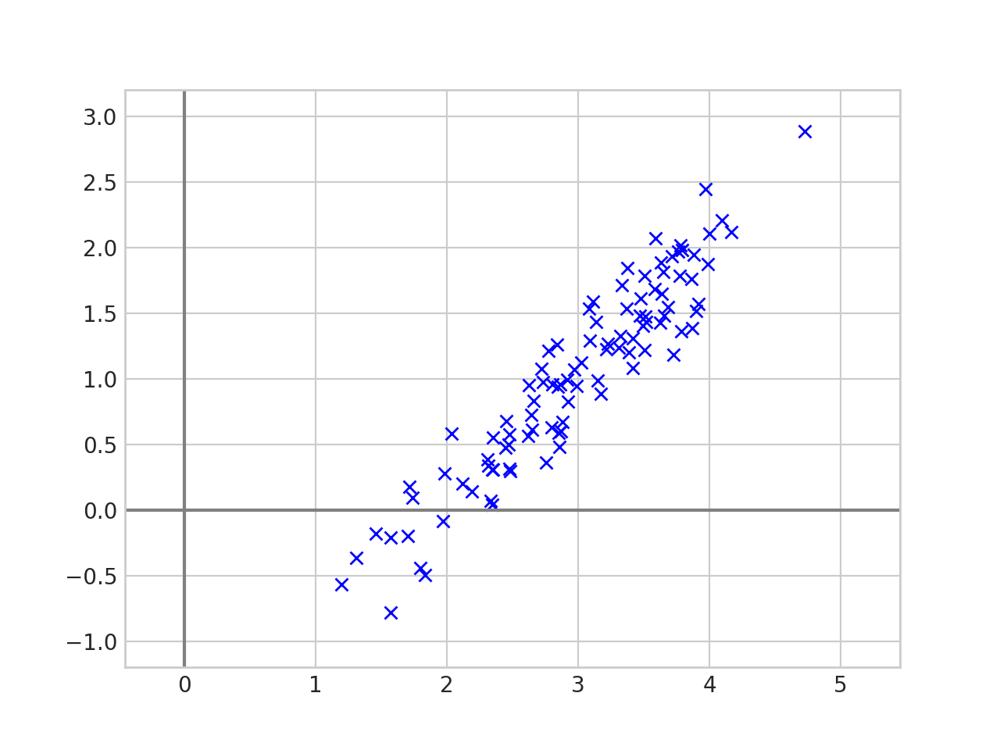
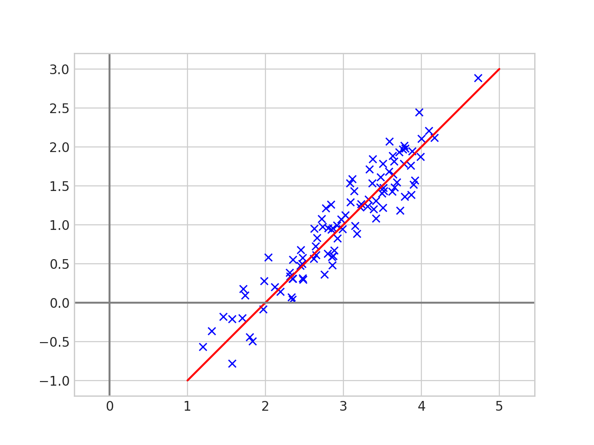
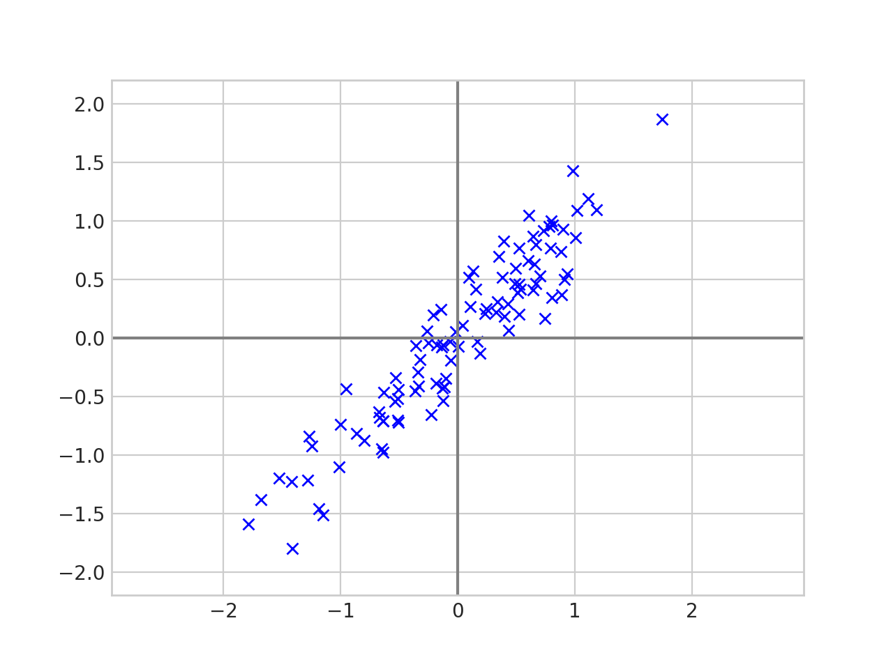
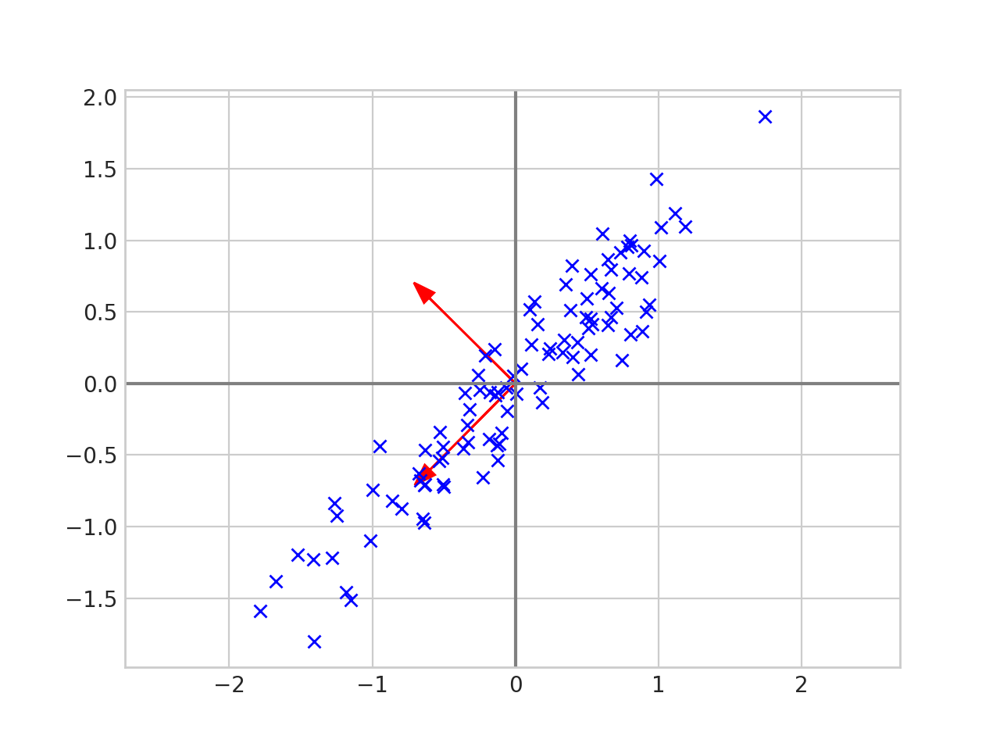
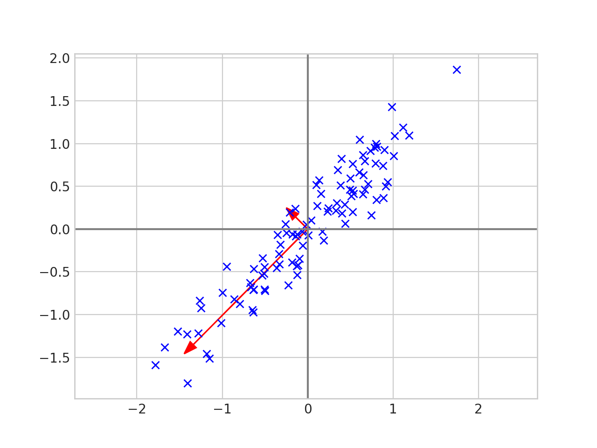
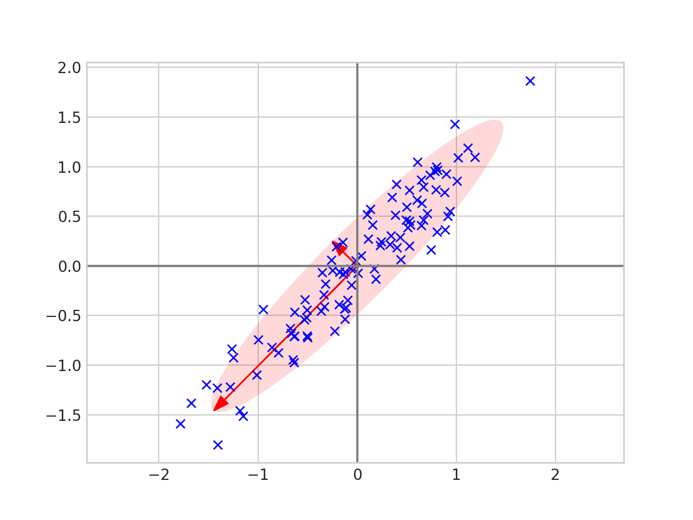
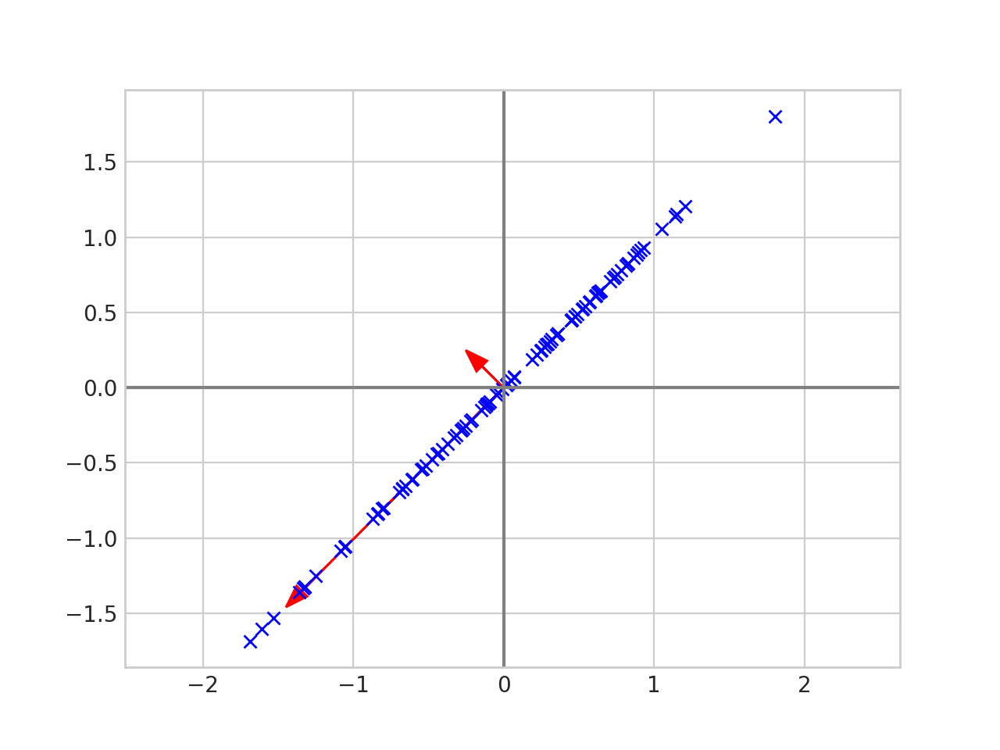
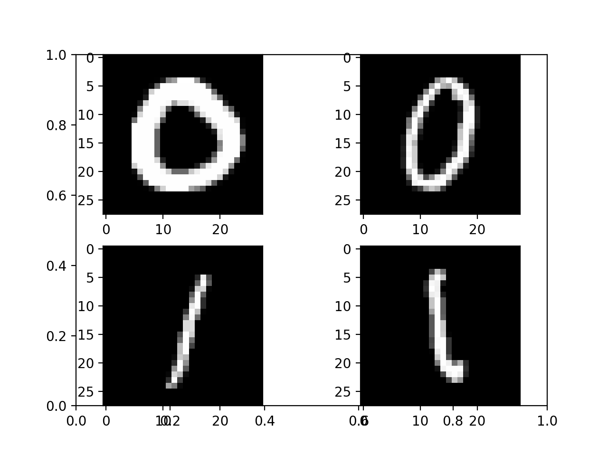
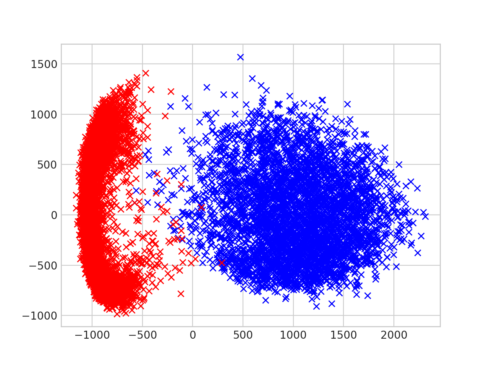

# Principal component analysis, pictures, code and proofs

## I.

Principal component analysis is used to reduce the the number of dimensions needed to represent your data.

The data above is two dimensional, but it is "almost" one dimensional in the sense that every point is close to a line.

Principal component analysis can help us understand the data better. Given the list of 2d points, $x_1, x_2, \dots , x_n \in \mathbb{R}^2$ we first center the data by calculating the mean $\overline{x} = \frac{1}{n}\sum_{i=1}^n x_i$ and replacing each $x_i$ with $x_i - \overline{x}$. Now the data looks like this.

We then put the data in a matrix.
$$
X = \begin{pmatrix}
| & | &  & | \\
x_1 & x_2 &\cdots & x_n \\
| & | &  & |\end{pmatrix}.
$$
And calculate the eigenvectors and eigenvalues of the *covariance matrix* $\frac{1}{n-1}XX^\top$.

What do the eigenvectors and eigenvalues of the covariance matrix tell us? Well let's plot the eigenvectors with the data.

The eigenvectors tell us the *direction* of the data. The first eigenvector has the same slope as the data and the second eigenvector is perpendicular to the first. Now let's scale each of the eigenvectors by its corresponding eigenvalue [1](#f1).

And draw an ellipse around the eigenvectors.

We can now see that the eigenvalues tell us how spread out the data is in the direction of that particular eigenvalue. Thus we can reduce the dimension of the data by projecting onto the line given by the largest eigenvalue.

The data is now one dimensional since it fits on a single line and each point is has not moved too far from its original spot.

In two dimensions this is the same as projecting onto the line of best fit, but this technique generalizes. If your data is $n$-dimensional then PCA lets you find the best $m$-dimensional subspace to project the data down onto; you just project your data onto the subspace spanned by the $m$ eigenvectors with the largest eigenvalues. If $m << n$ this can compress your data a lot, and PCA guarantees that this $m$ dimensional subspace is optimal in the sense that it minimizes the mean squared error between the original data points and the projected data points.

# II.

The data in the plots above was generated using a random number generator. Let's try PCA on a real dataset.

We will use the MNIST dataset, which is a collection of grayscale, 28x28 images of hand written digits. To simplify the analysis we will only look at zeros and ones in the dataset. Below is an example of the images from mnist.

To process the images we will:

 * Flatten each image into a $784 = 28\times 28$ vector.
 * Use PCA to project each 784 dimensional vector to a 2 dimensional vector.
 * Plot the 2 dimensional vectors, with images of '0' in red and images of '1' in blue.

The result looks like this.

You can see that the zeros and the ones are clustered together, and all we did was linearly project the raw pixels down to a two dimensional subspace!

## III.

Now that we have some intuition, the preceding discussion can be formalized into a theorem.

**Theorem:** Let $x_1, \dots , x_n \in \mathbb{R}^d$ be a sequence of data points. 
Let 
$$
X = \begin{pmatrix}
| & | &  & | \\
x_1 & x_2 &\cdots & x_n \\
| & | &  & |\end{pmatrix}
$$
 be the $d \times n$ matrix where each column is a data point.
Let $W = XX^\top$ (the $\frac{1}{n-1}$ factor from before does not affect the eigenvectors or order of the eigenvalues).
Then $W$ is [positive semidefinite](https://en.wikipedia.org/wiki/Positive-definite_matrix#Positive_semidefinite) and hence has eigenvectors $u_1, \dots , u_d$ which form an [orthonormal basis](https://en.wikipedia.org/wiki/Orthonormal_basis) for $\mathbb{R}^d$.
Let $\lambda_1, \dots , \lambda_d$ be the corresponding eigenvalues and without loss of generality assume $\lambda_1 \geq \lambda_2 \cdots \geq \lambda_d$.
The *projection error* for $x_i$ onto a subspace $V \subset \mathbb{R}^d$ is defined as $\|x_i - P_Vx_i\|_2^2$ where $P_V:\mathbb{R}_d \to \mathbb{R}_d$ is the projection operator.
Then for any positive integer $m < d$ the subspace $U_m := \operatorname{span}\{u_1, \dots , u_m\}$ minimizes the sum of the projection errors. In symbols,
$$
\sum_{i=1}^n \|x_i - P_{U_m}x_i\|_2^2 = \min_{\substack{V \subset \mathbb{R}^d \\ \operatorname{dim}V = m}} \sum_{i=1}^n \|x_i - P_Vx_i\|_2^2.
$$

*Proof:* 

Fix $m < d$ and let $V \subset \mathbb{R}^d$ be an $m$-dimensional subspace. Define the $d \times n$ error matrix
$$
E = 
\begin{pmatrix}
    | & | &  & |\\
     x_1 - P_Vx_1  & x_2 - P_Vx_2 & \cdots & x_n - P_Vx_n\\
     | & | &  & | \\
\end{pmatrix}
= X - P_VX.
$$
We want to minimize
$$
\sum_{i=1}^n \|x_i - P_Vx_i\|_2^2 = \|E\|_F^2
$$
where $\|\cdot \|_F$ is the [Frobenius norm](https://en.wikipedia.org/wiki/Matrix_norm#Frobenius_norm).
We now rewrite the error using matrix algebra
$$
\begin{align}\newcommand{\tr}{\mathrm{tr}}
\|E \|_F^2 
&= \| X- P_VX\|_F^2 \\
&=\tr\left(( X- P_VX)( X- P_VX)^\top\right) & (\|A \|_F^2 = \tr(A^\top A)) \\
&=\tr\left(( X- P_VX)( X^\top - X^\top P_V^\top)\right) \\
&=\tr\left(XX^\top - XX^\top P_V^\top - P_VXX^\top - P_VXX^\top P_V^\top \right) \\
&=\tr\left(W- W P_V^\top - P_VW - P_VW P_V^\top \right) & (W = XX^\top)\\
&=\tr\left(W- W P_V - P_VW - P_VW P_V \right) & (P_V = P_V^\top \text{ since $P_V$ is a projection matrix})\\
&=\tr(W)- \tr(W P_V) - \tr(P_VW) - \tr(P_VW P_V ) \\
&=\tr(W)- \tr(P_VW ) - \tr(P_VW) - \tr(P_VW) & (\tr(AB) = \tr(BA) \text{ and } P_V^2 = P_V)\\
&=\tr(W)- 3\tr(P_VW).
\end{align}
$$

The quantity $\mathrm{tr}(W)$ is a constant, so minimizing $\|E \|_F^2$ is the same as maximizing $\tr(P_VW)$. Let $\{v_1, \dots , v_m\} \subset \mathbb{R}^d$ be an orthonormal basis for $V$. Then 
$$
P_V = \sum_{i = 1}^m v_iv_i^\top
$$
so
$$
\begin{align}\newcommand{\tr}{\mathrm{tr}}
    \tr(P_VW)
    &= \tr(\sum_{i = 1}^m v_iv_i^\top W) \\
    &= \sum_{i=1}^m \tr\left(v_iv_i^\top w\right) \\
    &= \sum_{i=1}^m \tr(v_i^\top W v_i) & (\tr(AB) = \tr(BA)).
\end{align}
$$

Let 
$$
U = \begin{pmatrix}
| & | &  & | \\
u_1 & u_2 &\cdots & u_d \\
| & | &  & |\end{pmatrix}
$$
where the $u_i \in \mathbb{R}^d$ are the eigenvectors of $W$ as stated in the theorem. The matrix $U$ diagonalizes $W$ so $W = UDU^{-1} =  UDU^\top$ where 
$$D = \begin{pmatrix}
\lambda_1 & 0 & \dots & 0 \\
0 & \lambda_2 & \dots & 0 \\
\vdots & \vdots & \ddots & \vdots \\
0 & 0 & \dots & \lambda_n
\end{pmatrix}.
$$
Now
$$
\begin{align}\newcommand{\tr}{\mathrm{tr}}
\tr(P_VW)
&= \sum_{i=1}^m \tr(v_i^\top W v_i)  \\
&= \sum_{i=1}^m \tr(v_i^\top UDU^\top v_i)  \\
&= \sum_{i=1}^m  \tr((U^\top v_i)^\top D (U^\top v_i) 
\end{align}
$$

If $v_i = u_i$ for all $1 \leq i \leq m$ then 
$$U^\top v_i = U^\top u_i = (0, \dots, 0, 1, 0, \dots, 0)^\top$$
is the $i$-th standard basis vector. Thus 
$$
\begin{align}\newcommand{\tr}{\mathrm{tr}}
\tr(P_VW)
&= \sum_{i=1}^m  \tr((U^\top v_i)^\top D (U^\top v_i) \\
&= \sum_{i=1}^m \lambda_i
\end{align}
$$

Therefore it suffices to show that $\mathrm{tr}(P_VW) \leq \sum_{i=1}^m \lambda_i$ for all rank $m$ subspaces $V$.

We will show this is true in the case $m = 2$, i.e. $\mathrm{tr}(P_VW) \leq \lambda_1 + \lambda_2$ when $V$ is 2 dimensional. The case $m > 2$ uses the same argument but it is more notationally heavy. Let $\alpha = U^\top v_1 \in \mathbb{R}^d$ and $\beta =U^\top v_2 \in \mathbb{R}^d$. Note that since $U$ is unitary $\|\alpha\|_2^2 = \|\beta\|_2^2 = 1$ and $\langle \alpha, \beta \rangle = 0$.

The first step is to show that $\alpha_i^2 + \beta_i^2 \leq 1$ for all $i$. Let $e_i = (0, \dots , 0, 1, 0, \dots , 0)$ be the $i$-th standard basis vector. Since $\alpha$ and $\beta$ are orthogonal, the projection of $e_i$ onto $\operatorname{span}\{\alpha, \beta \}$ is given by
$$\hat{e}_i = \langle e_i, \alpha \rangle \alpha + \langle e_i, \beta \rangle \beta = \alpha_i \alpha + \beta_i \beta .$$
Then
$$ \alpha_i^2 + \beta_i^2 = \|\hat{e_i}\|_2^2 \leq \|e_i\|_2^2 = 1 $$
since a projected vector always has length less than or equal to the original vector.

The second step is to observe that $\sum_{i=1}^d (\alpha_i^2 + \beta_i^2) = \|\alpha \|_2^2 + \|\beta \|_2^2 = 2$.

Finally we want to maximize 
$$ \sum_{i=1}^d \lambda_i(\alpha_i^2 + \beta_i^2) $$
and we know that
$$\alpha_i^2 + \beta_i^2 \leq 1 \text{ and } \sum_{i=1}^d(\alpha_i^2 + \beta_i^2) = 2 .$$

The sum $\sum_{i=1}^d \lambda_i(\alpha_i^2 + \beta_i^2)$ is maximized when when the first and second coefficient are as large as possible, i.e. when $\alpha_1^2 + \beta_1^2 = \alpha_2^2 + \beta_2^2 = 1$. But then the second condition implies that $\alpha_i^2 + \beta_i^2 = 0$ for $i > 2$. Thus
$$ \sum_{i=1}^d \lambda_i(\alpha_i^2 + \beta_i^2) \leq \lambda_1 + \lambda_2. $$
$\square$

--------------------------------------------------------------
<b id="f1">1</b> I actually scaled by two times the square root of the eigenvalue. The eigenvalue tells you the variance and I wanted the standard deviation. I multiplied by two so that ellipse would capture most of the data. [↩](#a1)